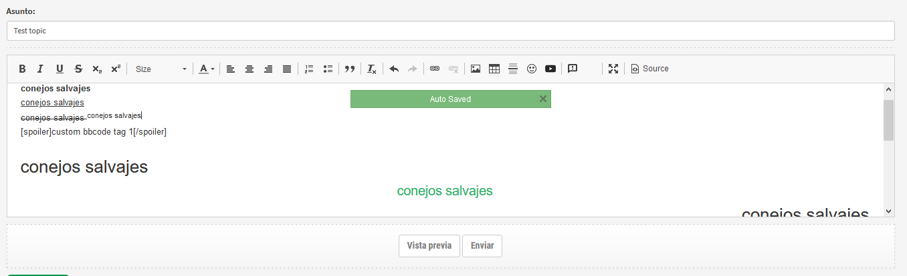

# CKEDITOR for phpBB 

### Editable textarea


## Features
* Basic HTML tags ('li', 'ul', 's', 'sub', 'sup', 'left', 'right', 'center', 'justify', 'font=', 'ol', 'table', 'td', 'tr', 'hr')
* Autosave
* Youtube tag
* Custom bbcode tags support
* Emojis support
* Imgur
* Mentions
* Code Snippet and syntax highlighter
* Clean code (no spaghetti code)

## How to install
1. Just copy folder dsr/ to {PHPBB_ROOT}/ext/
2. Go to Extensions -> CKEditor 4 -> Settings and configure

## Custom BBcode tags
* Place custom buttons icons in ./images/editor/custom/
* The name format is:
	{bbcode}.png (normal size)
	{bbcode}.hidpi.png (big size)
* Image size:
	normal size: 16 x 16
	big size: 32 x 32

## Imgur
* Create Imgur app
* Set "Imgur Client ID" in settings menu

## Mentions
* Install mentions from tis fork https://github.com/xchwarze/mention/tree/ckeditor

## Code Snippet and syntax highlighter
* Install https://github.com/s9e/phpbb-ext-highlighter
* Set "Theme used in the code snippet" and "Snippet code languages" in settings menu
* Examples
Theme used in the code snippet: `monokai_sublime`
Snippet code languages:
```
[
  { 'label': 'Arduino', 'lang': 'arduino' },
  { 'label': 'Autoit', 'lang': 'autoit' },
  { 'label': 'Bash', 'lang': 'bash' },
  { 'label': 'Basic', 'lang': 'basic' },
  { 'label': 'C/C++', 'lang': 'cpp' },
  { 'label': 'C#', 'lang': 'cs' },
  { 'label': 'CSS', 'lang': 'css' },
  { 'label': 'Delphi', 'lang': 'delphi' },
  { 'label': 'Diff', 'lang': 'diff' },
  { 'label': 'Dockerfile', 'lang': 'dockerfile' }
]
```

## Compatibility ##
* PHPBB 3.2.x and 3.3.x
